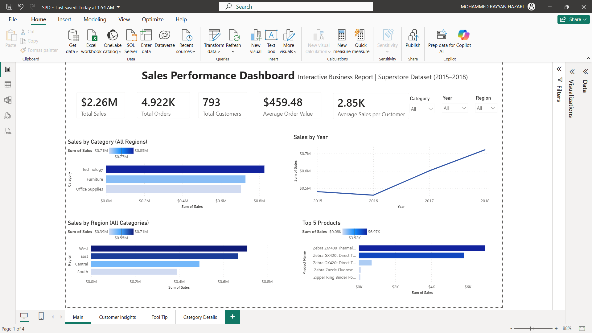
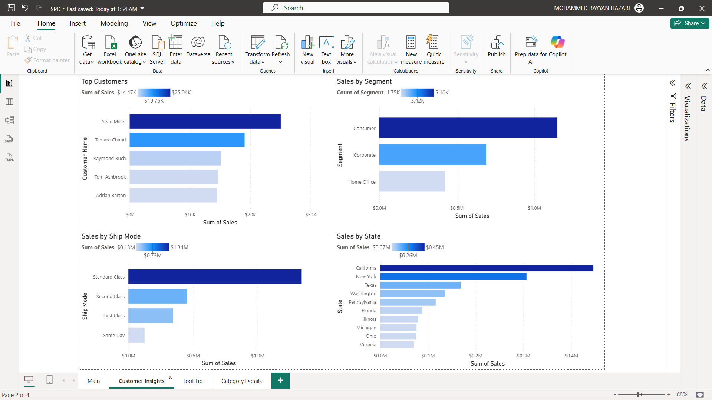
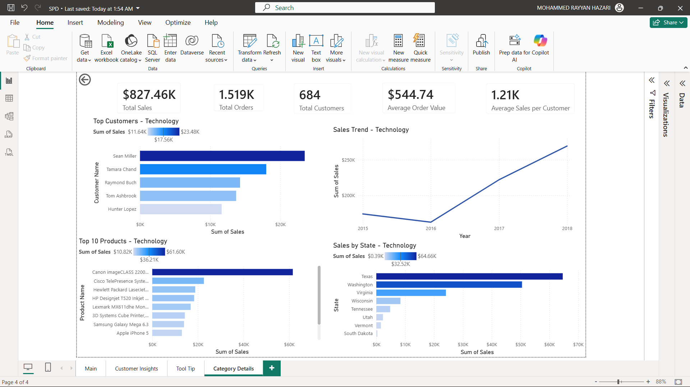

# 📊 Sales Performance Dashboard

An interactive Sales Performance Dashboard built using **SQL Server** and **Power BI** to analyze sales performance, customer behavior, regional trends, and product performance using the Sample Superstore dataset.

---

## 📌 Project Overview

This project demonstrates an end-to-end data analysis workflow.

The dataset was analyzed using SQL to answer business questions and then visualized in Power BI through an interactive dashboard with drill-through pages, tooltips, slicers, and DAX measures.

---

## 🛠️ Tools & Technologies

- SQL Server
- SQL
- Power BI Desktop
- DAX
- Microsoft Excel (Dataset)

---

## 📈 Dashboard Features

- KPI Cards
- Dynamic DAX Measures
- Interactive Slicers
- Drill-through Pages
- Custom Tooltips
- Conditional Formatting
- Customer Insights Dashboard
- Category Analysis Dashboard

---

# 🖥️ Dashboard Preview

## Main Dashboard



---

## Customer Insights



---

## Category Details



---

# 📊 Business Insights

- Technology generated the highest sales.
- The West region achieved the highest overall sales.
- Consumer segment contributed the largest share of revenue.
- Sales showed consistent year-over-year growth.
- Top customers contributed significantly to total sales.

---

# 🧠 SQL Skills Demonstrated

- Aggregate Functions
- GROUP BY & HAVING
- Window Functions
- CTEs
- Subqueries
- CASE Statements
- Ranking Functions
- Running Totals
- LAG()

---

# 📂 Repository Structure

```
sales-performance-dashboard/
│
├── Sales_Performance_Dashboard.pbix
├── Sales_Performance_Dashboard.pdf
├── Sample_Superstore.csv
├── SQL_Queries.sql
├── README.md
└── Images/
```

---

# 👨‍💻 Author

**Mohammed Rayyan Hazari**

Aspiring Data Analyst
